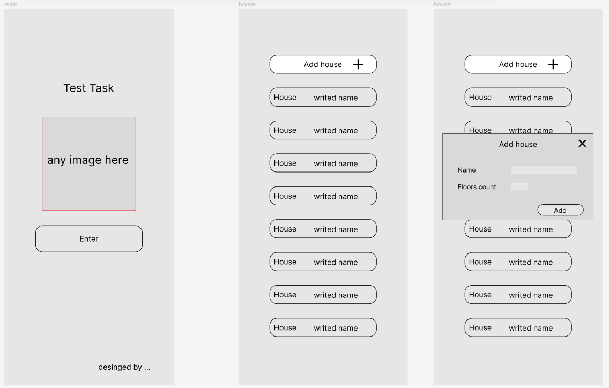
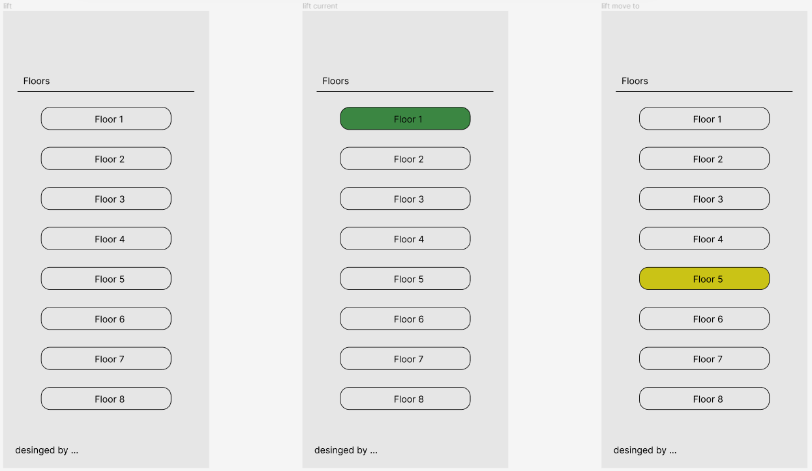

# scutum_test_assignment

Setup Project:

Initialize a Flutter project.
Design Implementation:

Implement screens according to the provided design: https://www.figma.com/file/3b1hEkkrFN03FAMdMF7Skb/Test-for-Flutter?type=design&node-id=0-1&mode=design&t=7mWGBo7ZFvqOeIqS-0.

SQLite Database:

Create SQLite tables for buildings and the number of floors.
MethodChannel Integration:

Utilize MethodChannel for communication between Flutter and the native part.
Background Notification Logic:

Implement background notification logic:
Send a notification every minute indicating the current floor of the elevator in the last selected building in the application.
Project Submission:

Share the results of the assignment by providing a link to the public Git repository.
Documentation:

Prepare documentation for the project.
Submission Instructions:

The completed assignment should be submitted through a public Git repository.
Include comprehensive documentation.
Note: Make sure to follow the design closely, implement the SQLite tables, integrate MethodChannel for communication, and implement the background notification logic as specified.

Requested design:

